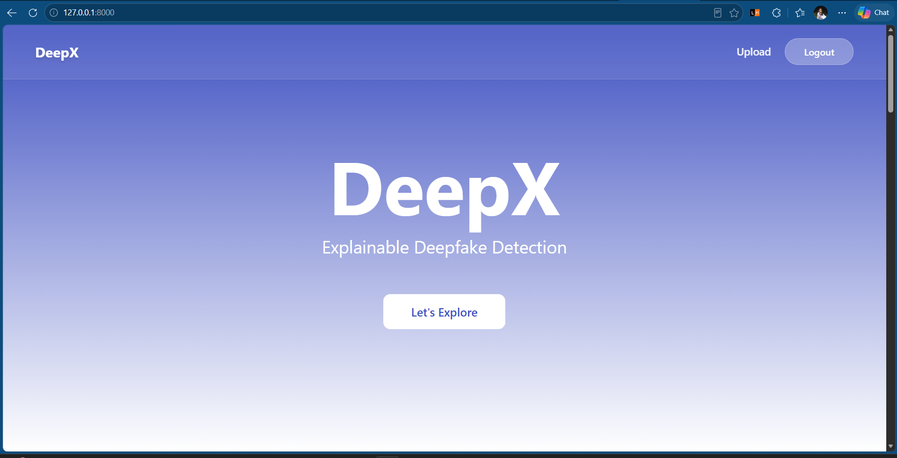
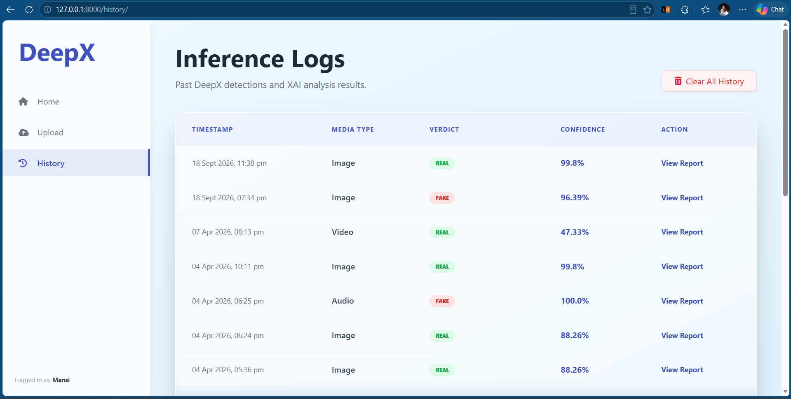

# 🎭 DeepX — Explainable Deepfake Detection System

DeepX is a deep learning-powered web application that detects whether
images, videos, and audio are real or fake.

The system combines deep learning models, preprocessing pipelines,
explainable AI, and a Django web interface to provide an end-to-end
deepfake detection system.

> **Note:** DeepX is currently available as a local Django application.
> A public live demo is not currently hosted.

---

## ✨ Key Features

- 🖼️ Image Deepfake Detection
- 🎥 Video Deepfake Detection
- 🎵 Audio Deepfake Detection
- 📊 Real/Fake Prediction with Confidence Score
- 🔍 Explainable AI using Grad-CAM
- 📈 Visual Feature Attribution
- 👤 User Registration and Login
- 📜 Detection History
- 🌐 Django-based Web Interface

---

## 🧠 How It Works

### Image Detection

Image → Preprocessing → ResNet50 → Real/Fake Prediction → Grad-CAM

### Video Detection

Video → Frame Extraction → Face Processing → CNN Features
→ LSTM/BiLSTM → Real/Fake Prediction

### Audio Detection

Audio → MFCC + Chroma + Mel Features → Neural Network
→ Real/Fake Prediction

---

## 🔍 Explainable AI

DeepX does not only provide a prediction.

It also provides visual information about the model's decision.

For image and video analysis, Grad-CAM-based heatmaps are used to
highlight regions that contribute to the prediction.

For audio analysis, spectrogram-based visualizations are generated
to represent important audio patterns.

---

## 🖥️ Application Screenshots

### Home Page



### Upload Media


### Analysis Result


### Explainability


### Detection History



---

## 🛠️ Technologies Used

- Python
- Django
- Django REST Framework
- TensorFlow / Keras
- OpenCV
- NumPy
- Librosa
- SQLite
- Jupyter Notebook
- Grad-CAM
- CNN
- ResNet50
- LSTM / BiLSTM

---

## 📁 Project Structure

```text
DeepX/
│
├── Audio Model/
├── Image model/
├── deepfake-video-detection-model/
├── core/
├── detection/
├── templates/
├── media/
├── output/
├── manage.py
├── db.sqlite3
├── requirements.txt
└── README.md
